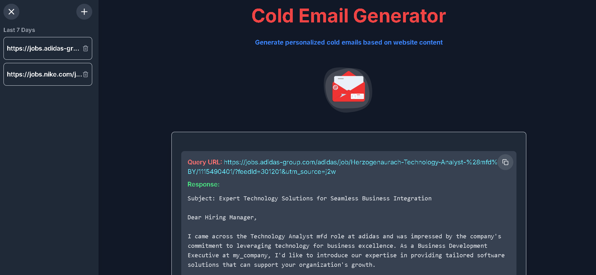

# Cold Email Generator

This project is a cold email generator that uses natural language processing to generate emails based on a given URL.

## Project Structure

The project consists of two main directories: `backend` and `frontend`.

### Backend

The backend is built using Flask, a Python web framework. It uses the Langchain library to generate emails based on a given URL.

### Frontend

The frontend is built using Next.js, a React-based framework. It provides a user interface for users to input a URL and generate an email.

## Technologies Used

* Flask (Python web framework)
* Next.js (React-based framework)
* Langchain (natural language processing library)

## Installation

To install the project, follow these steps:

1. Clone the repository using Git.
2. Install the required dependencies using pip and npm.
3. Run the backend using `python app.py`.
4. Run the frontend using `npm run dev`.

## Usage

To use the project, follow these steps:

1. Open the frontend in a web browser.
2. Input a URL in the input field.
3. Click the "Generate Email" button.
4. The generated email will be displayed on the page.

## Architecture

The overall architecture of the project is as follows:

## Frontend UI

The resulting frontend UI is as follows:

## .gitignore

The following files are ignored by Git:

* `node_modules/`
* `.next/`
* `build/`
* `.DS_Store`
* `*.pem`
* `npm-debug.log*`
* `yarn-debug.log*`
* `yarn-error.log*`
* `.env*.local`
* `.vercel`
* `*.tsbuildinfo`
* `next-env.d.ts`
* `__pycache__/`
* `*.pyc`
* `requirements.txt`
